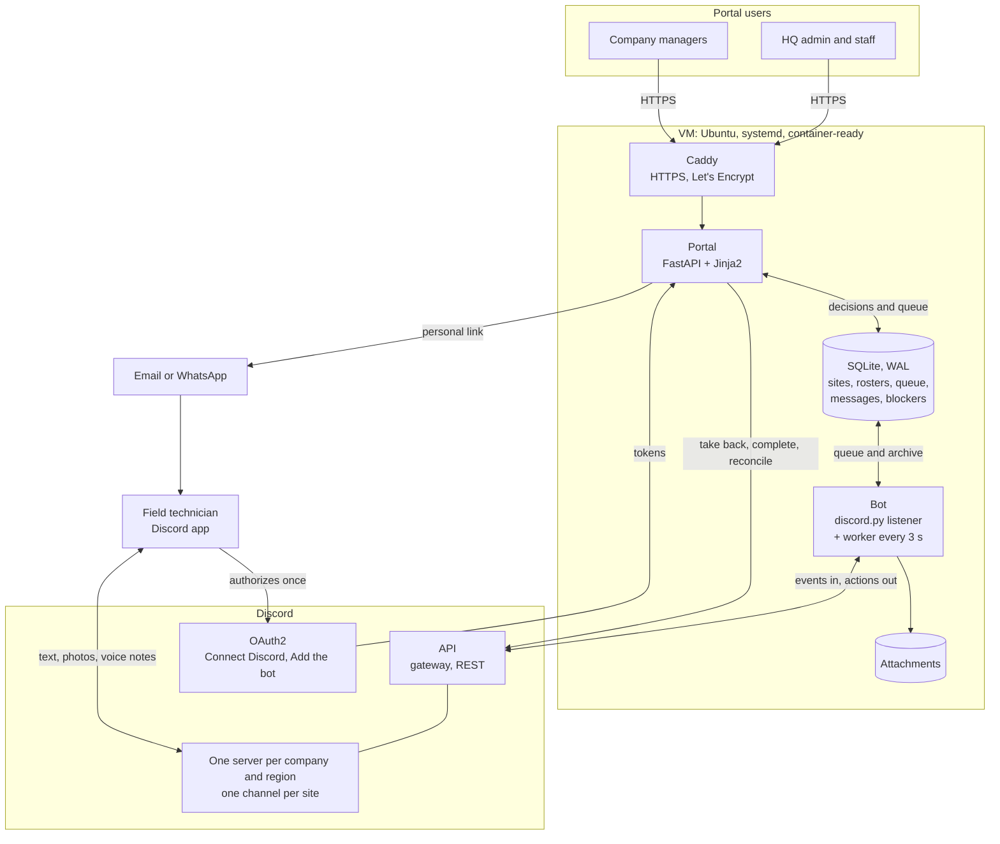
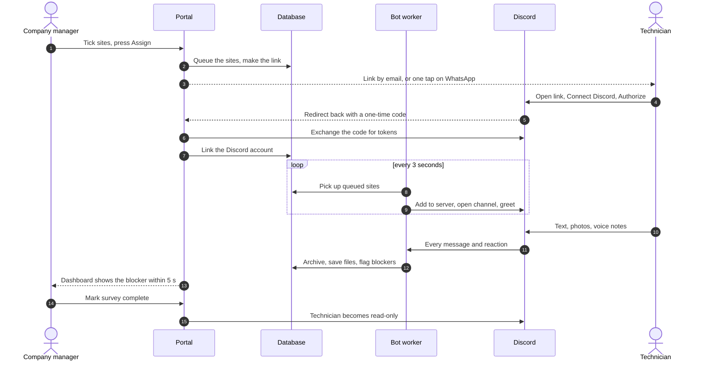

# RMS PreSurvey — Discord field operations with a web control tower

Field technicians survey and install Remote Monitoring Systems (RMS) at telecom tower sites across the country: 1,200+ sites now, designed for 10,000. Each site used to have its own WhatsApp group. That works for the technician on the tower, but nobody at head office can see across sites: photos disappear into chat history, blockers are spotted only by whoever happens to be reading, and nothing is searchable.

This project keeps the part that works and adds the part that was missing:

- **Discord is where the work happens.** Every site is a channel. A technician gets one link, once, and from then on every site they're given simply appears in their Discord, where they post text, photos and voice notes exactly as they did on WhatsApp. They never tap a button, run a command or log in anywhere else.
- **A web portal is the control tower.** The contractor running the rollout (**HQ**) and its subcontracting companies use it to load sites, assign technicians, and watch progress and blockers live. The portal decides; a bot carries it out in Discord.

**Stack:** Python 3.12 · discord.py · FastAPI + Jinja2 · SQLite (WAL) · Discord OAuth2 · Docker · GitLab CI/CD and GitHub Actions. About 450 automated checks, verified by deliberately breaking each protection (mutation testing).

---

## Architecture

### The system at a glance



Everything the portal decides goes into the database; the bot's worker carries it out in Discord and archives what comes back. Technicians only ever touch Discord and their one link.

### Two processes, one database

| Process | Built with | What it does |
|---|---|---|
| **Bot** | discord.py | Listens to every site channel: archives each message, downloads every attachment, flags likely blockers, resolves them on a ✅ reaction. A background worker (every 3 s) carries out what the portal decided: opens sites for technicians, sets up new servers, creates channels, keeps staff in every server. |
| **Portal** | FastAPI, Jinja2 | The control tower: sites, companies, technicians, assignment, completion, blockers, dashboards. Hosts the public pages a technician's link opens and the Discord sign-in callback. Makes the few Discord calls that must happen immediately (taking access back, completing a survey). |
| **Database** | SQLite in WAL mode | Shared by both processes. Holds the inventory, the rosters, the message archive and the queues that connect the two halves. |

**The portal records intent; the bot executes it.** When a manager assigns a technician, the portal writes queue rows and returns at once. The bot's worker picks them up, adds the person to the right Discord server, opens the channel, greets them, and marks the rows done. Every unit of work is idempotent and isolated: a failure is logged and retried with backoff (5 s doubling to 1 h), and never stops the loop. A heartbeat lets the portal show "bot offline" when it is.

### How the Discord side is laid out

- **One server per company per region**, named `Company_Region` (for example `FieldCo_South`), with a second (`_2`) once one holds 450 sites. Discord caps a server at 500 channels including categories, so sites go in categories of 50 (`Sites 001-050`, `Sites 051-100`, …) and the bot stops well short of the cap.
- **A server holds site channels and nothing else.** `@everyone` is denied viewing (and invites, voice and @everyone pings) server-wide, so anything created later is invisible by default.
- **Access is a per-member channel overwrite**, never a role: Discord allows only 250 roles per server. Four functional roles exist (Management, Engineer, Coordinator, Technician); staff see every site through them.
- **No slash commands and no buttons**, for anyone. The bot only listens and acts on the portal's decisions.

### Data model (main tables)

| Area | Tables |
|---|---|
| Inventory | `sites`, `regions`, `site_imports`, `companies` |
| People | `technicians`, `staff`, `portal_users`, `users` (Discord accounts seen) |
| Discord | `guilds` (servers and their state), `site_channels`, `site_techs`, `guild_staff` |
| Onboarding | `join_links` (one personal link per person), `discord_tokens`, `site_queue`, `emails` |
| Field work | `messages`, `attachments`, `blockers`, `site_progress`, `hermes_rules` (editable detection rules) |

### Live dashboards

Each page carries a fingerprint of the data it shows, scoped to what the viewer may see. The browser polls it every 5 seconds and, when it changes, swaps in the updated parts of the page. A new blocker shows up on the company's dashboard and on HQ's within seconds, and never on another company's.

---

## Workflows

### How a site reaches a technician



### Who does what

| Portal login | Sees | Does |
|---|---|---|
| HQ admin | everything | adds sites (the only role that can), allocates them, manages companies, regions, logins, Discord servers and HQ staff, edits detection rules, reconciles |
| HQ staff | everything | day-to-day: assigns, updates progress, completes and reopens surveys, handles blockers |
| Company manager | only their company's sites and technicians | adds their technicians, assigns them, updates progress, completes and reopens surveys |

Technicians have no portal login at all. Everyone who works in the field, including HQ's own people (under an in-house company), is a technician on exactly one company's roster, and a site belongs to exactly one company.

### 1. Sites come in (HQ admin)

Sites enter through a single Excel template, downloadable from the portal: one row per site, with region as a dropdown and every field in plain English. The admin uploads it for a company, or unallocated. Parsing is all-or-nothing: if any row is wrong, nothing is imported and the first problems are named by row. Formulas are stored as text and the parser uses a hardened XML reader. An upload claims unallocated sites for the chosen company but never takes another company's. A site that already has a Discord channel keeps its company and region, because channels can't move between servers.

### 2. A server is created for each company and region

Discord no longer lets bots create servers, so the portal works out which servers are needed and asks an HQ admin to make each one (about a minute). The admin then presses **Add the bot**. This is a Discord OAuth2 *code grant* whose signed state names the company, region and slot and the admin who asked. The server Discord returns in the token exchange is what gets claimed, never a server matched by name. With "Requires OAuth2 Code Grant" switched on, nobody can add the bot any other way, so a look-alike server can never receive technicians. Within a minute the bot strips Discord's default channels, locks `@everyone`, creates the roles, checks its own role sits above them, renames the server, and builds a channel for every site of that company and region. Each channel gets a pinned site brief and a private thread for access and configuration notes.

### 3. HQ staff are in every server, once

An HQ admin adds staff (name, Discord role, phone, email) on the portal. Each gets a personal link and connects Discord once. From then on the bot puts them in every server, current and future, with their role, and takes the role away if they're removed.

### 4. A technician is assigned

The manager adds a technician once (name, country, WhatsApp number, optional email). Numbers are stored in international form with their country, and the same number in any spelling is the same person. The manager ticks sites and presses **Assign**. The portal:

- queues the sites;
- makes sure the technician has their personal link (`/j/<token>`);
- emails it if there's an address, and offers a one-tap **Send on WhatsApp** with a ready-written message in English and Roman Urdu.

The technician opens the link, taps **Connect Discord** and authorizes once (scopes `identify guilds.join`). The bot then adds them to the right server through Discord's API, opens each site's channel for them alone, and greets them with the site brief at the bottom of the channel, where they'll see it. Later sites, in any server, open by themselves with no new link.

### 5. Field work

Every message is archived as it arrives (a missed stretch is backfilled after a restart), and every attachment is downloaded at once, because Discord's file links expire. Photos are auto-tagged from caption keywords and checked for blur. Blockers are detected, not filed: keyword and pattern rules, with "not a problem" phrases that override them, flag likely problems in English and Roman Urdu. The rules are database rows HQ edits in the portal, not code. A ✅ reaction in Discord, or a click in the portal, resolves a blocker. Detection is deliberately simple and is the part meant to be replaced by *Hermes*, a planned assistant built on the message archive.

### 6. Completing a survey

**Mark survey complete** (company manager or HQ) makes the site's technicians read-only: they can still read the channel but can no longer post, attach, react or start threads. Discord's "allow nothing" doesn't deny anything, so read-only is an explicit deny of each of those permissions. When HQ completes a site, the company's manager sees it at once, with who did it, and can **Reopen** it if it was a mistake.

### 7. Taking back and cleaning up

Taking a site back removes the technician's access immediately. Removing a technician takes back every site, cancels anything queued and retires their link. A company can only be removed once nothing hangs off it: sites, technicians, logins, or a server still in Discord. **Reconcile** compares what the database says with what Discord actually allows, including read-only against writable, and fixes any drift.

---

## Security

- **Tenancy fails closed.** Every route that takes a site, blocker, attachment, technician or queue id checks visibility from the database row, never from a form field, and answers 404 (not 403) outside the user's scope. A bulk assignment is refused whole if any site isn't the user's. The suite scans every page a manager can open for another company's data.
- **Sign-in:** argon2 password hashes, signed session cookies, a forced password change on first sign-in, and throttling per IP and per email.
- **OAuth:** state is signed and expires in 30 minutes; a personal link's token never goes into the state, logs or `Referer` (`Referrer-Policy: no-referrer` on those pages). A link can't be rebound to a second Discord account, and one Discord account can't belong to two people.
- **Discord tokens** are refreshed only by the bot, one account at a time, with a compare-and-swap on the old refresh token (Discord rotates them).
- **Names typed by one company are shown to another,** so none is ever placed in JavaScript or an unescaped attribute. WhatsApp links are built server-side, and email subjects can't be split into extra headers.
- **Secrets** live only in `.env` (owner-only permissions) and are set with `python -m tools.set_secret <NAME>`. It never echoes them, and it checks Discord values with Discord before saving.
- Pages can't be framed; the portal sits on loopback behind a TLS proxy.

## Discord limits the design works around

| Limit | Handling |
|---|---|
| Bots can't create servers | Guided one-minute creation by an admin; everything after is automatic |
| 500 channels per server (categories included), 50 per category | 450 sites per server in blocks of 50; a second server per region beyond that |
| 250 roles per server | Functional roles only; site access by member overwrite |
| Adding a member with roles fails if any role outranks the bot | Add the member first, then the role |
| An overwrite's "allow nothing" inherits | Read-only denies each posting permission explicitly |
| A person can be in 100 servers; an unverified bot in 100 | Documented; staff in every server reach it first |
| Refresh tokens rotate | Single refresher with compare-and-swap |
| A `tasks.loop` stops on an uncaught exception | Every worker unit is wrapped |

---

## Testing

`python -m tools.test_portal` runs about 450 checks against a throwaway database in a couple of minutes:

- **Real sign-in** through the login form and session cookie, never a faked user, so a scoping bug can't hide.
- **Discord and mail are faked, loudly.** The portal's REST calls, Discord's OAuth, the bot's discord.py objects and SMTP are all stand-ins, and any call that reaches the real network fails the run.
- **Coverage:** tenancy from both sides; assignment; the worker (server setup, channels, crash recovery, queue, token refresh, races between portal and bot, staff); the site template; completion; live updates; OAuth refusals; security; column alignment on every page; health checks.
- **Mutation testing:** each important protection was broken on purpose and a check had to go red. Two that didn't were found this way and their checks strengthened.

`python -m tools.smoke_portal` runs after every deploy: it renders every page as each role, checks table alignment, and asks one company for another's site (it must 404).

## Deployment and CI/CD

- **Production** runs both processes under systemd on a single VM, with Caddy terminating TLS (Let's Encrypt) in front of the portal on loopback. The firewall allows only SSH, HTTP and HTTPS. Deploys back up the database first, and the portal starts before the bot so it migrates the schema.
- **Containers:** one image (`python:3.12-slim`, non-root) runs both processes. `compose.yaml` runs one portal and one bot sharing a data volume, with health checks (`GET /healthz`, and the bot's heartbeat). The portal is published on loopback only, because Docker's published ports bypass the host firewall.
- **GitLab CI/CD** (`.gitlab-ci.yml`): **test** on every push → **build-image** on `main` (build, start the portal from the image, check its health, import the bot, push to the registry) → **deploy**, manual and optional (back up, stop the bot, bring up the portal, then the bot, then run the smoke check).
- **GitHub Actions** (`.github/workflows/tests.yml`) runs the suite on every push.
- **Scaling path:** the image is ready for Kubernetes; the data layer isn't yet. Running more than one portal needs Postgres, object storage for attachments and a shared sign-in throttle. The bot always stays a single replica (one gateway session; two would process every message twice).

## Running it

```bash
pip install -r requirements.txt httpx2
cp .env.example .env               # fill in; secrets via: python -m tools.set_secret <NAME>
python -m tools.test_portal        # the suite (no Discord needed)
uvicorn portal.main:app --port 8000
python bot.py
```

Or with Docker: `docker compose up -d --wait portal && docker compose up -d bot`. Portal logins are created with `python -m portal.createuser`.

## Project layout

| Path | Contents |
|---|---|
| `bot.py`, `backfill.py` | bot entry point; catching up after downtime |
| `cogs/capture.py` | archive, attachments, blocker detection, ✅ resolution |
| `cogs/servers.py` | the background worker: queue, server setup, channels, staff, heartbeat |
| `portal/main.py` | routes, including the public link pages and OAuth callback |
| `portal/auth.py` | sign-in and the visibility rules |
| `portal/assign.py`, `portal/links.py` | assignment, completion, personal links, email and WhatsApp |
| `portal/servers.py`, `portal/inventory.py`, `portal/insights.py` | servers needed, the site template, dashboard numbers |
| `portal/discord_api.py` | the portal's direct Discord REST calls |
| `portal/templates/`, `portal/static/` | pages, styles, live updates |
| `storage/db.py` | schema, migrations and every query |
| `utils/` | server layout, permission bits, OAuth, phone numbers, blocker rules, attachments, greeting |
| `tools/` | test suite, smoke check, site template writer, secrets, health checks |
| `Dockerfile`, `compose.yaml`, `deploy/` | containers and the deploy script |
